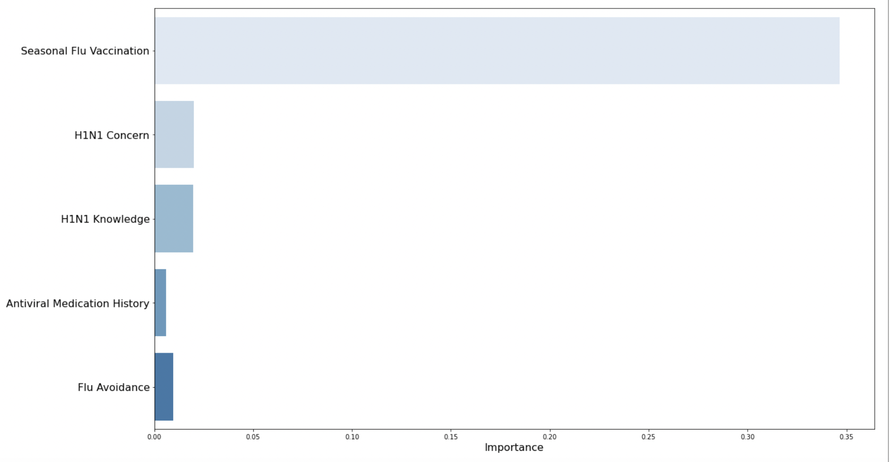

# Predicting H1N1 Vaccination  
**Data Scientist:**  Brandon Menendez, Xibei(Julian) He  
**Date:** June 3, 2022

## **Business Understanding**
In 2009 there was a global pandemic H1N1 also called swine flu. About 700million to 1.4billion people affected by H1N1 virus, which caused 249000-280000 deaths. But according to unofficial stats, the actual number is at least double of that. And it has not disappeared as the recent outbreaks happened in Morocco, Malta, and Iran in 2019. Especially we just went through another pandemic, and we think it is important to get educated on this issue. 

## **Key Business Questions**
1.	What factors determine whether someone is likely to get a H1N1 vaccine or not?
2.	What group of people require additional outreach and education to improve vaccination rates?

## **Data Understanding** 
The data we used are provided by 2009 national H1N1 Flu Survey. About 27,000 people were recorded for their opinions regarding vaccine and their personal info also collected. Then we did a little feature exploration. 
This is a graph showing the percentage change in population of vaccinator as their knowledge improves on H1N1 risks. The blue bar represents the non-vaccinator and red bar represents the vaccinator. 

 

Similarly, second graph shows the vaccine population from different racial groups. And you can see the African American population's vaccination rates is slightly lower than the rest of ethnic groups. 

 

## **Methodology & Results**

1. In our model, we started with feature selection to identify the most important factors, and then utilized different machine learning algorithms to train our models, and finally we generate our recommendations from those results. 

2. modeling. So, our model indicates 80% accuracy on predicting whether a person would get vaccine or not. Also, it identified 81% of vaccine population vs. 80% of anti (or non)-vaccinators. 

 

## **Statistical Analysis**
 

### **Factors Ranking**

 

This is Top 5 list starting from the seasonal vaccine status, concerns about H1N1 vaccine, knowledge about H1N1, antiviral medication history, and simply just want to avoid flu. 
 

## **Conclusions**
1. **Promotion:** We suggest our clients to boost vaccination rates by promoting the benefits of vaccination, and we especially need medical professionals to help in that process.

2. **Education:** We recommend healthcare agency and medical professionals to popularize basic education on H1N1 vaccine.

3. **Accessibility:** We recommend improving accessibility on vaccination by allocating vaccines resources to major healthcare providers and prioritize the access for vulnerable groups such as elders, children, and chronic illness.

## **Next Steps**
1. **Enhance modeling:** we expect to further improve model’s reliability by adopting more sophisticated data preprocessing steps.

2. **Geographical data:** Incorporate more historical and geographical data to gain better understanding on the business issue.

3. **Study Non-Vaccinator:** Study the reasoning of anti-vaccinator would allow us to better understand the psychology and behavior of people when encountering the challenge of pandemic.

## **Contact Info**
Email:
- Brandon Menendez: bmenendez94@gmail.com

- Xibei (Julian) He: julianhe1991@gmail.com

Linkedin: 
- Brandon Menendez: https://www.linkedin.com/in/brandon-menendez/

- Xibei (Julian) He: https://www.linkedin.com/in/xibeihe/

Github:

- Brandon Menendez [github](http://github.com/brandmend)

- Xibei (Julian) He [github](https://github.com/JulianHe1991)

