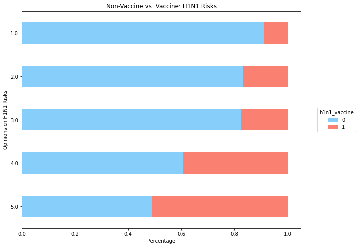
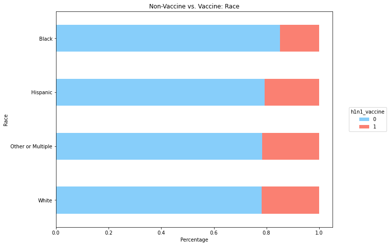

# Predicting H1N1 Vaccination  
**Data Science Students:**  Brandon Menendez, Xibei(Julian) He  
**Date:** June 3, 2022

## **Business Understanding**
The last global outbreak of the H1N1 virus took place in 2009, and was the third such global outbreak since the start of the 20th century
in just the years between 2009 and 2010. There were 700m - 1.4bn estimated cases worldwide, and an estimated 250 - 280K deaths. However, unofficial estimates put that number at almost double. And we are not out of the woods yet. H1N1 virus did not go away, as there have been recent outbreaks. Although there is no telling when a 4th global pandemic is imminent, being able to predict what people are and will get vaccinated is a critical piece for health agencies in combatting this going forward, especially if another H1N1 pandemic breaks out.  

 

## **Key Business Questions**
1.	What key factors determine whether someone is likely to get a H1N1 vaccine or not?
2.	What group of people require additional outreach and education to improve vaccination rates?

 

## **Data Understanding** 
The data we used are provided by 2009 national H1N1 Flu Survey. About 27,000 people were recorded for their opinions regarding vaccine and their personal info also collected. Then we did a little feature exploration. The blue bar represents the non-vaccinator and red bar represents the vaccinator. The graph below shows the riskier you see H1N1 is, the more likely you will get vaccine. On the scale of 5, you see the probability of vaccination is over 50%.

 &nbsp; &nbsp; &nbsp; &nbsp; &nbsp; &nbsp; &nbsp; &nbsp; &nbsp; 

Similarly, the second graph shows the vaccine population from different racial groups. Here black american population's vaccination rates is slightly lower than the rest of ethnic groups. 

 

## **Methodology & Results**

1. In our model, we started with feature selection to identify the most important factors, and then utilized different machine learning algorithms to train our models, and finally we generate our recommendations from those results. 

2. Modeling results: our model indicates 85% accuracy on predicting whether a person would get vaccine or not. Also, it identified 81% of vaccine population vs. 80% of non-vaccinators. 

 

## **Statistical Analysis**
### **Factors Ranking**

We also generated a ranking of factors that influence vaccination decision the most. This is top 5 list starting from the seasonal vaccine status, Doctor recommendation, Health Insurance status, H1N1 Vaccine Efficacy, and Risk opinion on H1N1. 

 

## **Recommendations & Conclusions**
1. **Promotion:** Boost vaccination rates by promoting the benefits of vaccination, and we especially need medical professionals to help in that process.

2. **Education:** Healthcare agency and medical professionals should help to popularize basic education on H1N1 vaccine.

3. **Accessibility:** Recommend improving accessibility on vaccination by allocating vaccines resources to major healthcare providers and prioritize the access for vulnerable groups such as elders, children, and chronic illness.

 

## **Next Steps**
1. **Enhance modeling:** We expect to further improve models reliability by adopting more sophisticated data preprocessing steps.

2. **Geographical data:** Incorporate more historical and geographical data to gain better understanding on the business issue.

3. **Study Non-Vaccinator:** Study the reasoning of anti-vaccinator would allow us to better understand the psychology and behavior of people when encountering the challenge of pandemic.

 

## **Contact Info**
Email:
- Brandon Menendez: bmenendez94@gmail.com

- Xibei (Julian) He: julianhe1991@gmail.com

Linkedin: 
- Brandon Menendez: https://www.linkedin.com/in/brandon-menendez/

- Xibei (Julian) He: https://www.linkedin.com/in/xibeihe/

Github:

- Brandon Menendez [github](http://github.com/brandmend)

- Xibei (Julian) He [github](https://github.com/JulianHe1991)

